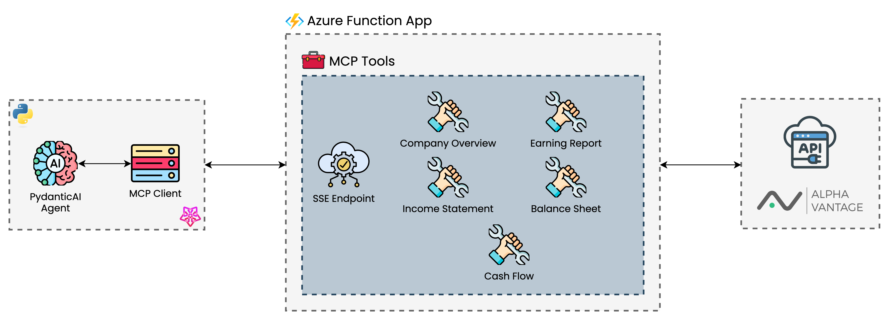

# AlphaVantage MCP Server with Azure Functions

This project implements an Azure Function that serves as a bridge between an Agent as a MCP Server and the AlphaVantage Financial API. 
It allows AI agents to access financial data and perform financial analysis through tools exposed via MCP. 

<div align="center">
  
</div>

The Azure Function exposes the following financial data endpoints as MCP tools:
- Company Overview
- Income Statement
- Balance Sheet
- Cash Flow
- Earnings Report

There is a demo agent created with PydanticAI in the `agent` directory that can be used to test the MCP server. More information [Demo Agent](#demo-agent) file.

## Prerequisites

- An Azure subscription
- [Azure Developer CLI (azd)](https://learn.microsoft.com/en-us/azure/developer/azure-developer-cli/install-azd)
- [Azure Functions Core Tools](https://learn.microsoft.com/en-us/azure/azure-functions/functions-run-local)
- Python 3.11
- An AlphaVantage API key (see [AlphaVantage](https://www.alphavantage.co/))

## Local Development

1. Clone this repository
2. Create a virtual environment and install dependencies:
```bash
uv sync --frozen
```

3. Create a `local.settings.json` file in the `src` directory with your AlphaVantage API key:
```json
{
  "IsEncrypted": false,
  "Values": {
    "FUNCTIONS_WORKER_RUNTIME": "python",
    "AzureWebJobsStorage": "UseDevelopmentStorage=true",
    "ALPHAVANTAGE_API_KEY": "your-alphavantage-api-key"
  }
}
```

4. Run the function locally:
```bash
cd src
func start
```

## Deployment

1. Log in to Azure:
```bash
azd auth login
```

2. Deploy the application:
```bash
azd up
```

This will provision the necessary Azure resources and deploy the Function App.


> **Note:** For setting up environment variables, refer to the [Adding Environment Variables](#adding-environment-variables) section.


## Getting the MCP Endpoint URL

After deployment, retrieve your MCP extension system key:

```bash
az functionapp keys list \
  --resource-group <resource_group> \ 
  --name <function_app_name>
```

Your MCP endpoint URL will be:

```
https://<funcappname>.azurewebsites.net/runtime/webhooks/mcp/sse?code=<your-mcp-extension-system-key>
```

## Adding Environment Variables

You can add environment variables to your Azure Function in two ways:

### 1. Using the parameters file (recommended for deployment)

Add your environment variables to the `infra/main.parameters.json` file:

```json
{
  "parameters": {
    // Other parameters...
    "functionAppEnvironmentVariables": {
      "value": {
        "ALPHAVANTAGE_API_KEY": "your-api-key",
        "MY_VARIABLE": "my-value"
      }
    }
  }
}
```

Then deploy with:

```
azd up
```

### 2. Using Azure CLI (for updating existing deployments)

```bash
az functionapp config appsettings set \
  --name <function_app_name> \
  --resource-group <resource-group> \
  --settings ALPHAVANTAGE_API_KEY=<your-api-key>
```

## Setting up VS Code for MCP Development

This project includes a `.vscode/mcp.json` configuration file that helps you connect to your MCP endpoint during development. This file contains:

1. **Input definitions** - Prompts for:
   - The Azure Functions MCP Extension System Key (stored securely)
   - Your Azure Functions App Name

2. **Server configurations**:
   - `remote-mcp-function` - Connects to your deployed Azure Function using the inputs above
   - `local-mcp-function` - Connects to a locally running function on port 7071

This allows you to test your MCP tools directly from VS Code during development, either against your local function app or your deployed Azure instance.

## Demo Agent

The `agent` directory contains an example of how to use this MCP endpoint with an AI agent using the Agno framework. You can use this as a starting point for your own financial analysis agent.

## Infrastructure Code Attribution

The infrastructure code for this project was adapted from [Azure-Samples/remote-mcp-functions-python](https://github.com/Azure-Samples/remote-mcp-functions-python), which provides a template for deploying Python functions as remote MCP tools on Azure.

